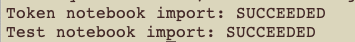

# How to generate Azure Active Directory personal tokens and store them as Databricks Secrets

## Requriements

- A user account in an Azure Databricks workspace
- Domain name of the Azure Databricks workspace, e.g. `adb-xxx.azuredatabricks.net`  
- Tenant ID in Azure AD
- Databricks-managed (_not_ Azure Key Vault backed) secret scope in which to store the tokens. You should ensure that only you have access to this secret scope.

## Setup

- Install the CLI and dependencies from the provided `.whl` file.
```
$ pip install https://github.com/r3stl355/gimme-azure-creds/releases/download/0.1.0-beta/gimme_azure_creds-0.1.0-py3-none-any.whl
```

## Run

Use the `--help` option to list all of the required arguments for the tool:
```
$ gimme-azure-creds --help

Usage: gimme-azure-creds [OPTIONS]

  Obtain a user token from Azure Active Directory and store it as a secret in
  an Azure Databricks workspace

Options:
  --workspace TEXT           URL for Azure Databricks workspace (exclude
                             'https://') e.g.
                             'adb-1137934926163478.18.azuredatabricks.net'
  --tenant TEXT              ID for your Azure Active Directory tenant, e.g.
                             '9f37a392-f0ae-4280-9796-f1864a10effc'
  --secret-scope TEXT        A Databricks-managed (_not_ Azure Key Vault
                             backed) secret scope in which to store the
                             tokens. You should ensure that only you have
                             access to this secret scope.
  --secret-key-access TEXT   Secret key (name) for your Azure AD access token
  --secret-key-refresh TEXT  Secret key (name) for your Azure AD refresh token
  --help                     Show this message and exit.
```


*Running the tool creates a simple web server to intercept the authorization code, you may be asked for some permissions.*

```
$ gimme-azure-creds --workspace adb-0123456789.10.azuredatabricks.net \
--tenant 9505fc56-d08c-4b97-ae66-71a5fc357e42 \
--secret-scope myScope \
--secret-key-access aad_access_token \
--secret-key-refresh aad_refresh_token
```

If all goes well you should see the following in the Terminal, and a Databricks workspace loaded in the browser (likely showing a login prompt).



Login, create a notebook and access the secrets using the `dbutils.secrets.get()` utility, documented [here](https://docs.microsoft.com/en-gb/azure/databricks/dev-tools/databricks-utils#dbutils-secrets)

The Access Token can be used to make Databricks API calls or for JDBC connections. A corresponding Refresh Token is stored to the second secret key and can be used to refresh Access Tokens.