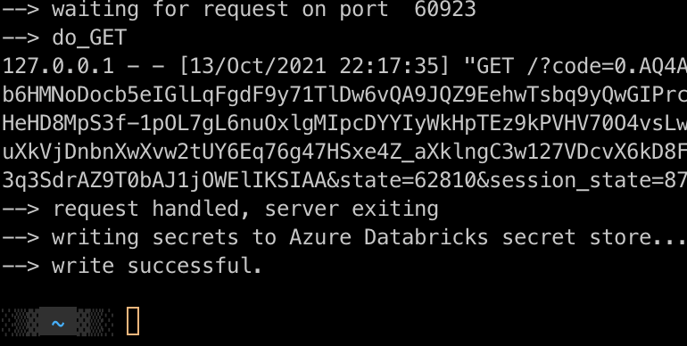

# How to get an Azure Active Directory token into Databricks Notebook

More info about setting up an app with AzureDatabricks permission in Azure portal can be found here: https://docs.microsoft.com/en-us/azure/databricks/dev-tools/api/latest/aad/app-aad-token#configure-an-app-in-azure-portal

## Requriements

- A user account in an Azure Databricks workspace capable of running notebooks
- Domain name of the Azure Databricks workspace, e.g. `adb-xxx.azuredatabricks.net`  
- Tenant ID in Azure AD
- The ID of the application registered with the Azure AD endpoint in Azure portal with added AzureDatabricks permission (Client ID)

## Setup

- Create and activate a Python environment. Here an example of using Conda (tested on MacOS)
```
conda create -n azure-token-test python=3.7 -y
```
```
conda activate azure-token-test
```
- Install dependencies
```
pip install -r requirements.txt
```
- Set variable values specific to your environment in the `config.py` 

## Run

*The next script creates a simple web server to intercept the authorization code, you may be asked for some permissions.*

```
python gimme-azure-creds.py
```

If all goes well you should see the following in the Terminal, and a Databricks workspace loaded in the browser (likely showing a login prompt).



Login, open and run the `token_test` notebook uploaded into your Workspace (under your `/Users/<your email>` or whatever path you set in `config.py`).

ACCESS_TOKEN value in the `token` notebook can be used to make Databricks API calls or for JDBC connections. A REFRESH_TOKEN can be 
used to refresh Access Tokens.